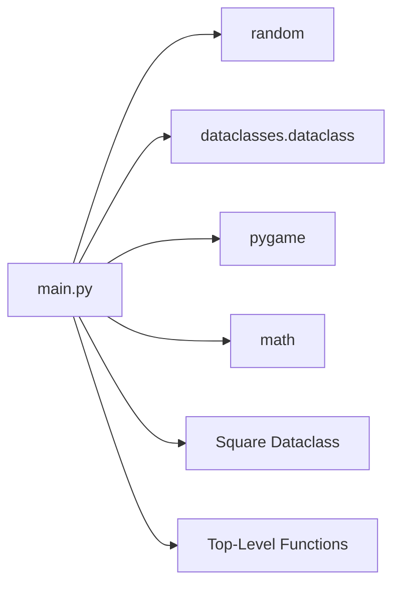
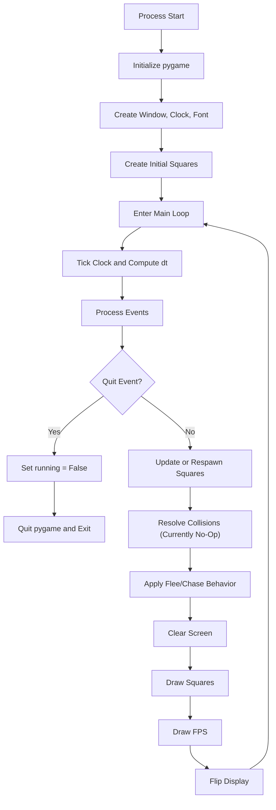
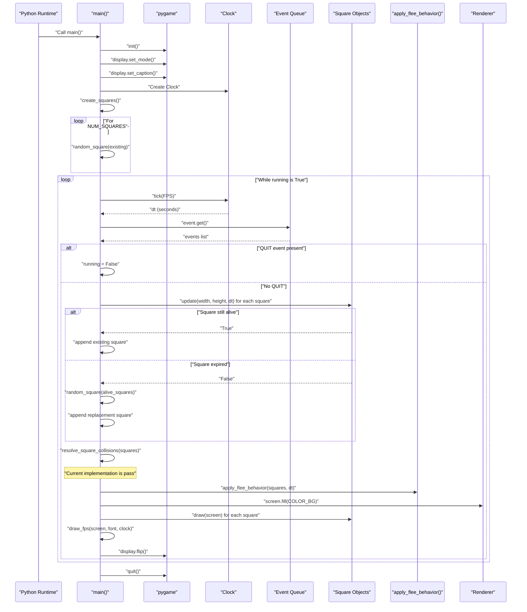

# Architecture Documentation

This document describes the concrete architecture of the pygame square simulation implemented in `main.py`.

## Scope and Entry Points

- Primary runtime entry point: `main.py` via `if __name__ == "__main__": main()`.
- Secondary variant implementation: `withcol.py` (similar structure, integer-velocity version).
- Primary execution path documented below is from `main.py`.

## Module Dependency Graph

Notes:
- `random` is used for spawn position, velocity directions, color, and steering jitter.
- `pygame` provides event loop, rendering, timing, and rectangle primitives.
- `math.hypot` is used for distance and vector magnitude calculations.

## High-Level Runtime Flow

## Function-Level Call Graph

```mermaid
graph TD
    START["__main__ Guard"] --> MAIN["main()"]

    MAIN --> INIT["pygame.init()"]
    MAIN --> SETMODE["pygame.display.set_mode()"]
    MAIN --> CAPTION["pygame.display.set_caption()"]
    MAIN --> CLOCK["pygame.time.Clock()"]
    MAIN --> FONT["pygame.font.Font(...)"]
    MAIN --> CREATE["create_squares()"]

    CREATE --> RS1["random_square(existing)"]

    MAIN --> EVENTGET["pygame.event.get()"]
    MAIN --> TICK["clock.tick(FPS)"]

    MAIN --> SQUPDATE["Square.update(width, height, dt)"]
    MAIN --> RS2["random_square(alive_squares)"]

    MAIN --> COLL["resolve_square_collisions(squares)"]
    MAIN --> FLEE["apply_flee_behavior(squares, dt)"]

    MAIN --> FILL["screen.fill(COLOR_BG)"]
    MAIN --> SQDRAW["Square.draw(screen)"]
    MAIN --> DFPS["draw_fps(screen, font, clock)"]
    DFPS --> GETFPS["clock.get_fps()"]
    DFPS --> RENDER["font.render(...)"]
    DFPS --> BLIT["surface.blit(...)"]

    MAIN --> FLIP["pygame.display.flip()"]
    MAIN --> QUIT["pygame.quit()"]

    FLEE --> HYPOT1["math.hypot(dx, dy)"]
    FLEE --> HYPOT2["math.hypot(vx, vy)"]
```

## Primary Execution Sequence (Full)

## Key Architectural Notes

- The simulation uses an update-render loop with time-based motion (`dt`).
- Square lifetime is enforced by `death_time`; expired squares are replaced during the frame update stage.
- Behavior steering is pairwise across all squares (`O(n^2)` check in `apply_flee_behavior`).
- Collision stage exists in the pipeline but is currently a no-op (`pass`).
- `withcol.py` is an alternate script that keeps a similar loop shape but uses integer-step movement and a placeholder collision block with commented logic.
